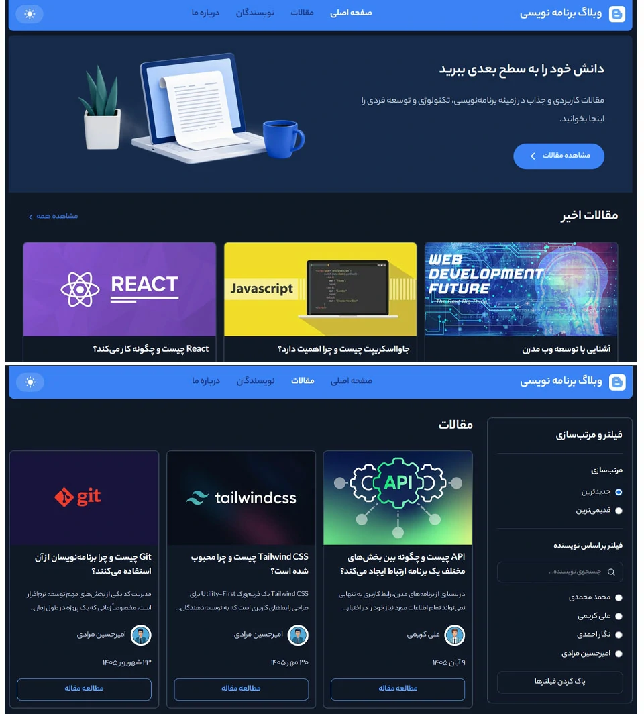
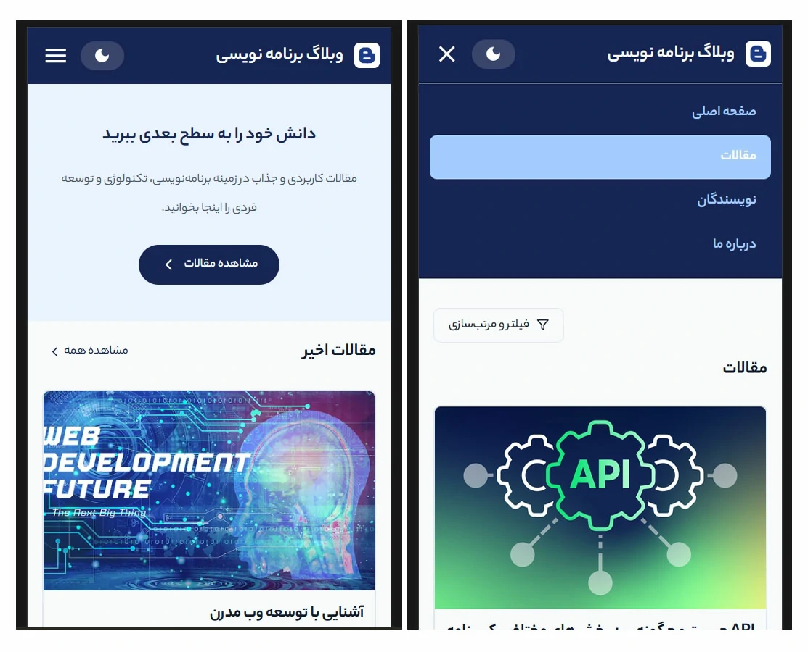

# 📝 وبلاگ برنامه‌نویسی

یک وبلاگ فارسی برای انتشار و مطالعه مقالات مرتبط با **برنامه‌نویسی، تکنولوژی و توسعه فردی** که با React ساخته شده و اطلاعات آن از طریق Hygraph دریافت می‌شود.

📸 Screenshots




## 🚀 تکنولوژی‌های استفاده شده

- React
- React Router
- Tailwind CSS
- Apollo Client
- GraphQL
- Hygraph
- React Icons
- react-toastify
- jalaali-js
- JavaScript

## ✨ امکانات

- نمایش مقالات
- صفحه اختصاصی هر مقاله
- صفحه نویسندگان
- صفحه اختصاصی هر نویسنده
- نمایش تاریخ انتشار به زبان فارسی
- جستجو و فیلتر مقالات
- مرتب‌سازی مقالات
- سیستم ارسال کامنت
- نمایش وضعیت ارسال کامنت
- Dark Mode
- طراحی Responsive برای موبایل، تبلت و دسکتاپ
- Loading Spinner هنگام دریافت اطلاعات
- Navigation با `NavLink`
- منوی همبرگری در نسخه موبایل

## 🛣️ Routes

| مسیر             | صفحه         |
| ---------------- | ------------ |
| `/`              | صفحه اصلی    |
| `/blogs`         | مقالات       |
| `/blogs/:slug`   | جزئیات مقاله |
| `/authors`       | نویسندگان    |
| `/authors/:slug` | صفحه نویسنده |
| `/about`         | درباره ما    |

## 🎨 طراحی

رابط کاربری پروژه با Tailwind CSS ساخته شده و از طراحی Responsive پشتیبانی می‌کند.

پروژه دارای دو حالت:

- ☀️ Light Mode
- 🌙 Dark Mode

تم انتخاب‌شده کاربر نیز در `localStorage` ذخیره می‌شود.

## 🔌 دریافت اطلاعات

داده‌های مقالات، نویسندگان و سایر اطلاعات وبلاگ از طریق **GraphQL** و **Hygraph** دریافت می‌شوند.

ارتباط با API توسط Apollo Client انجام شده است.

## 📱 Responsive Design

پروژه برای اندازه‌های مختلف صفحه طراحی شده است:

- 📱 Mobile
- 📱 Tablet
- 💻 Desktop

در نسخه موبایل Navigation به صورت **Hamburger Menu** نمایش داده می‌شود.

## 💬 کامنت‌ها

کاربران می‌توانند برای هر مقاله کامنت ارسال کنند.

فرم کامنت شامل:

- نام
- ایمیل
- متن کامنت

است و در صورت خالی بودن فیلدها، پیام هشدار نمایش داده می‌شود.

کامنت ارسال‌شده نیز ابتدا در وضعیت انتظار تأیید قرار می‌گیرد.

## 📅 تاریخ فارسی

تاریخ انتشار مقالات با یک Helper اختصاصی به فرمت فارسی نمایش داده می‌شود.

برای مثال:

```text
۱ شهریور ۱۴۰۵
```

## 👨‍💻 توسعه‌دهنده

GitHub:

`https://github.com/dev-mohammad78`

---

⭐ اگر این پروژه برایتان مفید بود، خوشحال می‌شوم آن را Star کنید.
